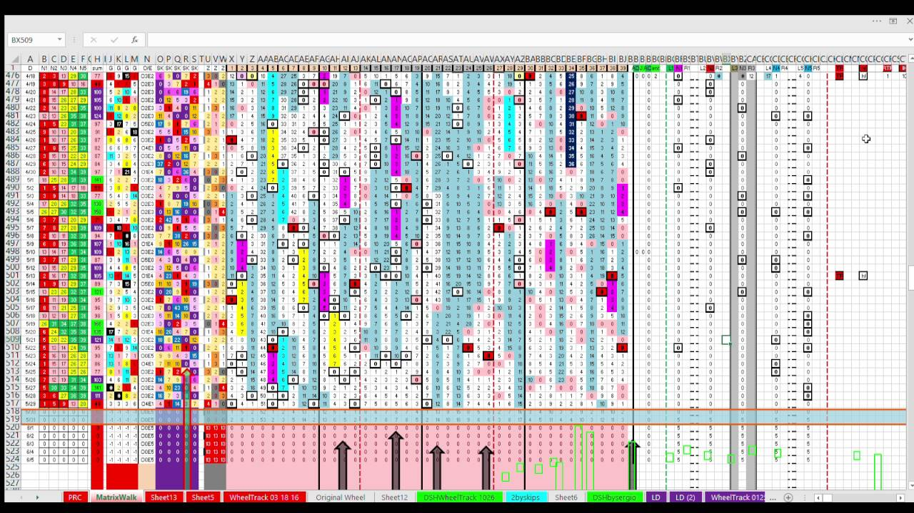
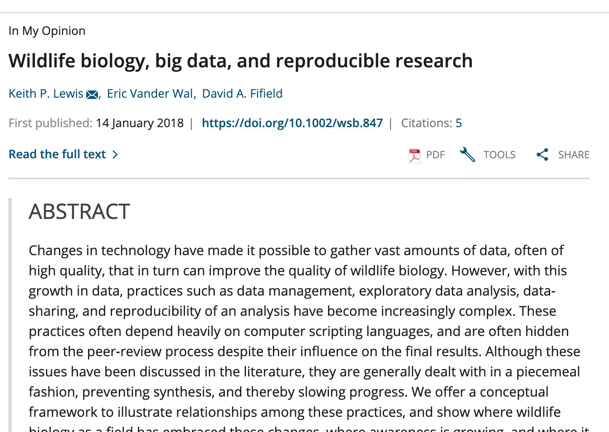
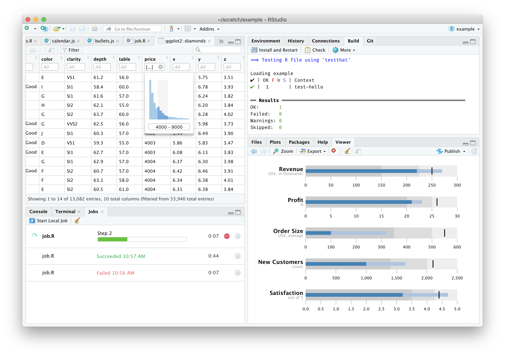

```{r setup, include=FALSE}
options(htmltools.dir.version = FALSE)
knitr::opts_chunk$set(
  fig.width=9, fig.height=3.5, fig.retina=3,
  out.width = "100%",
  cache = FALSE,
  echo = FALSE,
  message = FALSE, 
  warning = FALSE,
  hiline = TRUE
)

library(here)
```

```{r xaringan-themer, include=FALSE, warning=FALSE}
library(xaringanthemer)
style_duo_accent(
  primary_color = "#1381B0",
  secondary_color = "#FF961C",
  inverse_header_color = "#FFFFFF"
)
```

---

# Learning goals

* Understand the process of create reproducible documents
* Have a first insight in the data visualization practices using datasets
* Experience the diversity of options that open practices offers to communicate your results. 


---

## Assignments for ARCHE Plateform

After that, several questions need to be answered at the end of the tutorial. 

A pdf document with the results  are going to be upload to the ARCHE Platform to evaluate the comprehension of the module.


---

# Recommended setup {-}

1. Sign up for free version: https://rstudio.cloud/

2. Use you UL account!

3. Voila!, C'est bon


---
background-image: url("http://assets.aims.fao.org.s3-eu-west-1.amazonaws.com/public/figures/Open%20Science%20Monitor.jpg")
background-position: 95% 50%
background-size: 50%
class: left middle

.pull-left[
*"Open Science refers to ongoing changes <br>in the way research is conducted: 
for scientists themselves, through increasing the use of <br> 
open access scientific publishing and open data, <br>
and for the public, through increasing their understanding of and participation in science... <br>
Open Science is one of three priority areas for European research, science and innovation policy,"- [RAND Corporation](http://aims.fao.org/activity/blog/open-science-monitor-access-data-and-trends-open-science).*
]

---

# The document pipeline

```{Fig_open-science, }
knitr::include_graphics("figures/Article-pipeline-1.png")
```

---

## Music Vs. Research

.pull-left[
```{r, include=TRUE, fig.align='center', cache=TRUE, out.width='80%'}
knitr::include_graphics("figures/Musica.jpeg")
```

]
.pull-right[
```{r, include=TRUE, fig.align='center', cache=TRUE, out.width='100%'}
knitr::include_graphics("figures/Paper.png")
```

]


---

## Music Vs. Research

.pull-left[
```{r, include=TRUE, fig.align='center', cache=TRUE, out.width='100%'}

```

]
.pull-right[
```{r, include=TRUE, fig.align='center', cache=TRUE, out.width='100%'}
knitr::include_graphics("figures/Paper.png")
```
]

---

# Main goal

- Understand the importance of the *replication principle* in research
- Create a first dynamic document using a *Literate programming approach*


---

# The document pipeline

```{r, include=TRUE, fig.align='center', cache=TRUE, out.width='90%'}
knitr::include_graphics("figures/Article-pipeline-2.png")
```


How to describe in detail this section for Research & Industry purposes

---

# Reproducibility and Replicability

**Reproducibility**: 

Refers to the ability of a researcher to duplicate the results of a prior study using the same materials as were used by the original researcher (Goodman, Fanelli, and Ioannidis 2016).

- Focuses on the validity of the data analysis
- "Can we trust this analysis?"

.footnote[

Goodman, Steven N., Daniele Fanelli, and John P. A. Ioannidis. 2016. “What Does Research Reproducibility Mean?” Science Translational Medicine 8 (341): 341ps12–341ps12. https://doi.org/10.1126/scitranslmed.aaf5027.

]
--

**Replicability:** 

This is the act of repeating an entire study, independently of the original investigator without the use of original data (but generally using the same methods).

- Important for policymakers and regulatory decisions


---


## Why do we need Reproducible Research?

- Avoid misconduct such as fraudulent data and plagiarism
- Data-intensive research (e.g Big data research)
- Distributed research





---
background-image: url("https://figures-na.ssl-figures-amazon.com/figures/I/41KSVC8Q2JL.jpg")
background-position: 90% 50%
background-size: 30%


## Reproducibility concepts

Two key elements: 

- **Literate programming for enabling reproducibilty**
- Version control for enhancing transparency

*...for significantly better documentation of programs, <br>and that we can best achieve <br>this by considering programs to be works of literature.*


.footnote[
D. E. Knuth, Literate Programming, The Computer Journal, Volume 27, Issue 2, 1984, Pages 97–111, https://doi.org/10.1093/comjnl/27.2.97
]

---

## Literate programming for enabling reproducibilty

*Literate programming refers to the use of a computing environment for authoring documents that contain a mix of natural (eg. English) and computer (eg. R) languages (Schulte et al. 2012)*

```{r, include=TRUE, fig.align='center', cache=TRUE, out.width='80%'}
knitr::include_graphics("figures/Word-excel.jpg")
```


.footnote[ Schulte, Eric, Dan Davison, Thomas Dye, and Carsten Dominik. 2012. “A Multi-Language Computing Environment for Literate Programming and Reproducible Research.” Journal of Statistical Software 46 (1): 1–24. https://doi.org/10.18637/jss.v046.i03.]

---

## Literate programming for enabling reproducibilty

*Literate programming refers to the use of a computing environment for authoring documents that contain a mix of natural (eg. English) and computer (eg. R) languages (Schulte et al. 2012)*

```{r, include=TRUE, fig.align='center', cache=TRUE, out.width='70%'}

```

---
## What is R/RStudio?

- R is a statistical programming language
- RStudio is a convenient interface for R (an integrated development environment, IDE)


.footnote[ Schulte, Eric, Dan Davison, Thomas Dye, and Carsten Dominik. 2012. “A Multi-Language Computing Environment for Literate Programming and Reproducible Research.” Journal of Statistical Software 46 (1): 1–24. https://doi.org/10.18637/jss.v046.i03.]


---

## Rmarkdown

```{r, include=TRUE, fig.align='center', cache=TRUE, out.width='70%'}
knitr::include_graphics("figures/Rmarkdown.png")
```

- [R Markdown: The Definitive Guide](https://bookdown.org/yihui/rmarkdown/)

---
## Github

1. Open source
2. Control version

```{r, include=TRUE, fig.align='center', cache=TRUE, out.width='50%'}
knitr::include_graphics("https://github.githubassets.com/figures/modules/logos_page/GitHub-Mark.png")
```


class: middle

#  What is Data Visualization?

- are graphical representations of data

--

- use different colors, shapes, and the coordinate system to summarize data

--

- tell a story

--

- are useful for exploring data


---

class: middle

## For example

[Coronavirus Pandemic (COVID-19)](https://ourworldindata.org/coronavirus)

[How LGBTQ+ hate crime is committed by young people against young people](https://www.bbc.com/news/uk-46543874)

[Why Time Flies](https://maximiliankiener.com/digitalprojects/time/)

[Mandatory Paid Vacation](https://www.instagram.com/p/CE1kpM5FhWR/?utm_source=ig_web_copy_link)

[Why are K-pop groups so big?](https://pudding.cool/2020/10/kpop/)


---

# Summary

- Reproducible research is important as a **minimum standard**, particularly for studies that are difficult to replicate
- Infrastructure is needed for creating and distributing reproducible documents, beyond what is currently available
- There is a growing number of tools for creating reproducible documents

**Some challengues**

- It is not the solution for everyone.

---
class: middle

# Main goal of the workshop

- Create a first reproducible document 


##  https://rstudio.cloud/project/2139211


---

class: center, middle

# Thanks!


