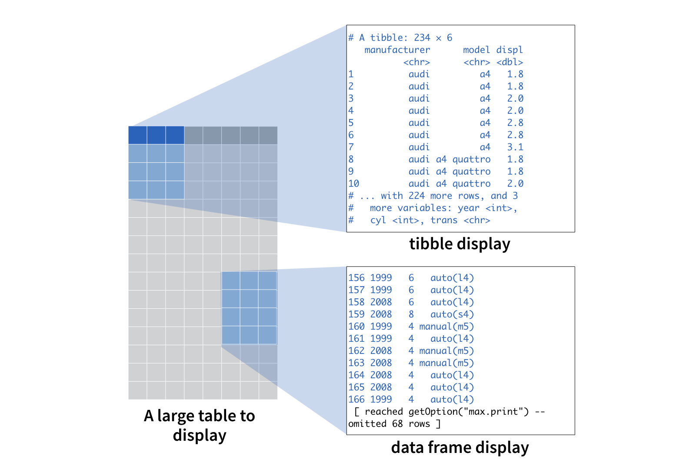

```{r setup, include=FALSE}
knitr::opts_chunk$set(echo = TRUE)

#libraries
#devtools::install_github( "ThinkR-open/prenoms")
library("prenoms")

```

# But du Workshop:

Le but principales est la comprendre la  reproducibilité des résulstats dans la recherche scientific.

>Nous allons reprendre plusieurs éléments de base du langage **R**. 
Une bonne compréhension des bases du langage, bien qu'un peu ardue de prime abord, permet de comprendre le sens des commandes qu'on utilise et de pleinement exploiter la puissance que **R** offre en matière de manipulation de données.


# Bases de la programmation R
## Fonctions & Objets

Résumé des elements importants 

1. Les vecteurs sont l’un des objets de base de R et correspondent à une liste de valeurs. Leurs propriétés fondamentales sont :

1. Clasess:
  - Numerical, Character, Integer or Logical
2. Objects
  - Vectors, Lists, Data frames,  Factors, Missing values.
3. Operations
  - Subsetting, Logical subsetting
  
### Variables
```{r Ex_1}
# Définition d'une variable type 'numerique' 
a_int <- 20
b_int <- 30
```

```{r Ex_2}
# Définition d'une variable type 'Entier' 
a_int <- 20L
b_int <- 30L
```


```{r Ex_3}
# Définition d'une variable type 'Logical' (Valeur Entier)
a_log <- TRUE
b_log <- FALSE
```


```{r Ex_4}
# Définition d'une variable type 'character' (texte)
a_char <- "Bonjour"
b_char <- "Comment ça va?" 

```

### Vecteur

La fonction `c()` ('*combination fonction*') permet de creer de vecteur:

```{r Ex_5}
# Faire un vecteur de longitud 5.
etudiants <- c("Maelle", "Luca", "Sandrine", "Marcelo", "Jean")
taille  <-  c(188, 173, 187, 164, 178)
age <- c(32, 23, 35, 35, 54)
```

- Determinez:
  - Age moyenne des des étudiants dans la variable `moyenne_global`.
  - Longueur du vecteur étudiants. (voir `?length`)


```{r Ex_6}

# moyenne_global <- ....

# total_etu <- ...

```

Lé résultat de la somme est:  **`r moyenne_global`**.
La totalité des étudiantes est: **`r moyenne_global`**
  

### List

- Faites unu liste avec les vecteurs que vous avez fait dans l'exercise précedente

```{r Ex_7}
# Creation d'une List
v1 <- c("Maelle", "Luca", "Sandrine", "Marcelo", "Jean")
v2  <-  c(188, 173, 187, 164, 178)
v3 <- c(32, 23, 35, 35, 54)

a_list <- list(etudiant = v1,
               taille = v2,
               age = v3 )
a_list

```

### Data frames

- Pourquoi le data.frame suivant marque un erreur?. Faites la correction necessaire.

```{r Ex_8}
#etudiants <- c("Maelle", "Luca", "Sandrine", "Marcelo", "Jean")
#taille  <-  rnorm(8, mean = 173, sd = 5 )

#a_dataframe <-  data.frame(etudiants, taille)

```


- Seleccionez la colonne `Species`  du data.frame `iris`, et trouvez les valeurs minimal, maximal, moyenne de la colonne `Sepal.Length`.

```{r Ex_9}
data <- iris$Sepal.Length
```


---

**Take a rest of 5 Min**

---


# Bases de la visualisation de données
##Fonction `ggplot()`

A retenir de ce module:

1. Créer des graphiques avec un **modèle** (ou **template**) {ggplot2} réutilisable
1. Ajouter des variables à un graphique avec **aesthetics**
1. Sélectionner le "type" de votre graphique avec **geoms** 


- Faites un nuages de points avec les variables `Sepal.Length` et `Sepal.Width` du data.frame `iris` en faisant la distintion des couleur pour chaque spèce de fleur.


```{r Ex_10}
# ggplot(data = <DATA>) + 
#   aes(x = <X>, y = <Y>)
#  <GEOM_FUNCTION>()

ggplot(data = iris) +
  aes(x = Sepal.Length, y = Sepal.Width, color = Species) +
  geom_point()
```


- Faites un boxplot avec memes variables `Sepal.Length` et `Sepal.Width` du data.frame `iris` en faisanat la distintion des coulor pour chaque Spece de fleur.


```{r Ex_11}
# ggplot(data = <DATA>) + 
#   aes(x = <X>, y = <Y>)
#  <GEOM_FUNCTION>()

ggplot(data = iris) +
  aes(x = Sepal.Length, y = Sepal.Width, color = Species) +
  geom_boxplot()
```


- Pouvez-vous ajouter les titres, et labels dans le dernièr graphique? (regardez `?labs`)
 

```{r Ex_12}

```


# Tidyverse

## Import Data

`readr` et `readxl` permettent d’importer des données tabulaires depuis des fichiers texte ou Excel.
Une interface intégrée à RStudio facilite leur usage en permettant de modifier les options d’importation et d’avoir un aperçu en temps réel.

```{r}
# Load the library
library(tidyverse)
```


-  Lire une base de donnes CSV:

```{r}
data.csv <- read_csv("data/data-twitter-article.csv")
data.csv
```

- Lire un fichier EXCEL

```{r}
# Lire un base de donnes Excel
library(readxl)

# Don't show up
data.excel <- read_excel("data/Test_Attrakdiff.xls" ) 

#identifying the onglets
onglets <- excel_sheets("data/Test_Attrakdiff.xls")


# Reading the onglet that corresponds
data.excel <- read_excel("data/Test_Attrakdiff.xls",  sheet = onglets[2]) 


# Reading the onglet that corresponds
data.excel <- read_excel("data/Test_Attrakdiff.xls",  
                         sheet = onglets[2], 
                         skip = 2) 

# Selecting the corresponding rows
data.excel <- data.excel %>% slice(1:11)

# Changing names columns
col_names <- names(data.excel)
col_names[1] <- c("Participant")

names(data.excel) <- col_names
  
data.excel <- 
  data.excel %>%  select(Participant : QP7)


# Pivot_longer to analyse
data.excel <- 
  data.excel %>% pivot_longer(cols = -Participant, 
                              names_to = "Variables",
                              values_to = "Answers")


# Changing the scale of the answers
data.excel <- 
  data.excel %>% mutate( 
    change_scale =
      case_when(
        Answers == 7  ~ 3,
        Answers == 6  ~ 2,
        Answers == 5  ~ 1,
        Answers == 4  ~ 0,
        Answers == 3  ~ -1,
        Answers == 2  ~ -2,
        Answers == 1  ~ -3,
        TRUE ~ as.numeric(Answers)
      )
  )

# Changing the sign of the answers
data.excel <- 
  data.excel %>% mutate( 
    change_scale_orientation =
      case_when(
        Variables %in% 
          c("ATT1*", "ATT3*","ATT5*",
            "ATT7*", "QHI2*", "QHI3*", "QHI6*", 
            "QHS1*", "QHS3*", "QHS4*", "QP1*",
            "QP2*", "QP3*", "QP5*")  ~ as.numeric(change_scale)*(-1),
        TRUE ~ as.numeric(change_scale)
      )
  )


## Approach 2
data.excel <- 
  data.excel %>% mutate( 
    change_scale_orientation_II =
      case_when(
        str_detect(data.excel$Variables, "\\*") ~ as.numeric(change_scale)*(-1),
        TRUE ~ as.numeric(change_scale)
      ))

# Doing the Groups
data.excel <- 
  data.excel %>% mutate( 
    Factors =
      case_when(
        str_detect(data.excel$Variables, "QP") ~ "QP",
        str_detect(data.excel$Variables, "QP1") ~ "QP",
        
        str_detect(data.excel$Variables, "QHS") ~ "QHS",
        
        str_detect(data.excel$Variables, "QHI") ~ "QHI",        
        str_detect(data.excel$Variables, "QH1") ~ "QHI",        
        
        str_detect(data.excel$Variables, "ATT") ~ "ATT",
        TRUE ~ "ATTENTION"
      ))

# Doing the calclus

data.excel %>% 
  group_by(Factors) %>% 
  summarise(Moyenne = mean(change_scale_orientation)) %>% 
  ggplot() +
  aes(y=Moyenne, x= Factors) +
  #geom_point() +
  #aes(x=Factors , y=Moyenne, group=1 ) +
  geom_bar(stat="identity", position = "dodge", lwd = 1,  aes(fill = Factors)) +
  #geom_bar(aes( stat = "identity"))
  geom_point() +
  #geom_line() +
  coord_flip() + 
  scale_x_discrete(breaks=c("ATT","QHI","QHS","QP"), 
                   labels=c("Attractivité Globale", 
                            "Qualité hédonique - Identification", 
                            "Qualité hédonique - Stimulation",
                            "Qualité Pragmatique"))
```


## Export de tableaux de données

On peut avoir besoin d’exporter un tableau de données dans R vers un fichier dans différents formats. La plupart des fonctions d’import disposent d’un équivalent permettant l’export de données. On citera notamment :

- `write_csv`, `write_csv2` permettent d’enregistrer un data frame ou un tibble dans un fichier au format texte délimité

```{r}
# Exporté des donnes

# With csv et csv2
write_csv(data.csv, file= "data/export-csv.csv")
write_csv2(data.csv, file= "data/export-csv2.csv")

```


## Tibble vs Data.Frame

### Qu'est-ce qu'un tibble ?

Un tibble est un type spécial de table. R affiche les tibbles de manière astucieuse chaque fois que le package **tibble** est chargé. 

- R n'affichera alors uniquement que les dix premières lignes d'un tibble ainsi que toutes les colonnes qui tiennent dans la fenêtre de votre console. 

- R ajoute également des informations récapitulatives utiles sur les composants tibble, telles que les types de données de chaque colonne et la taille totale du jeu de données.

Chaque fois que vous n'avez pas le package `{tibble}` chargé, R affichera le tibble comme s'il s'agissait d'un `data.frame`. 
En fait, les tibbles **sont** des **data.frames**, mais dans une version améliorée.

Vous pouvez penser à la différence entre l'affichage du data.frame et l'affichage du tibble comme ceci :

```{r,  out.width = "75%"}


data.frame(data.csv)

tibble(data.csv)
names(data.csv)
length(data.csv$`Journal identity`)

# View tibles
View(data.csv)
```


```{r, include=FALSE}
# ALLEZ AU TUTORIAL III
```


- Graphiquez la curve de votre prenom. 
- Dans quelle année specifiquement la popularité de votre prenom a été maximale?


```{r Ex_13, echo = FALSE, message=FALSE}

# Curve de prenom

prenoms_france %>% 
  filter(name == "Fabio", sex == "M") %>% 
  ggplot() +
    aes(x = year, y = prop) +
    geom_line() +
    labs(title = "Popularité du prénom Fabio")

# Anne de Popularité

fabio <- 
  prenoms_france %>% 
  filter(name == "Fabio", sex == "M") 
max(fabio$prop)
fabio %>% filter(prop == max(fabio$prop))


```


```{r, include=FALSE}
# ALLEZ AU TUTORIAL III
```


## Challenges 

Appliquez vos connaissances de {dplyr} pour relever les challenges suivants.


### Challenge du Top 10


Identifiez les Top 10 prenoms utilisez en France?

```{r Ex_15}
#prenoms_france %>% 
```

```{r Ex_14-solution}
tops <- prenoms_france %>% 
  group_by(name, sex) %>% 
  summarise(total = sum(n)) %>% 
  ungroup() %>% 
  top_n(10, total)

```


### Challenge "number one" - focus sur les garçons

Combien de prénoms de garçons distincts ont atteint le rang de numéro 1 au cours d'une année ?

```{r Ex_14}

```

```{r Ex_13-solution}
prenoms_france %>% 
  group_by(year, sex) %>% 
  mutate(rank = min_rank(desc(n))) %>% 
  filter(rank == 1, sex == "M") %>% 
  ungroup() %>% 
  summarise(distinct = n_distinct(name))
```

### Challenge "number one" - focus sur les filles

Combien de prénoms de filles distincts ont atteint le rang de numéro 1 au cours d'une année ?

```{r Ex_14}

```

```{r Ex_14-solution}
prenoms_france %>% 
  group_by(year, sex) %>% 
  mutate(rank = min_rank(desc(n))) %>% 
  filter(rank == 1, sex == "F") %>% 
  ungroup() %>% 
  summarise(distinct = n_distinct(name))
```


# Attractif

## Tidy

Les principes d’un jeu de données tidy sont les suivants :

- chaque variable est une colonne
- chaque observation est une ligne
- chaque type d’observation est dans une table différente


```{r}
read_excel
```


### Challenge "number one" - graphique

`number_ones` est un vecteur contenant les prénoms de garçons qui ont été classés au rang 1.

```{r echo = TRUE}
number_ones
```

Utilisez `number_ones` avec `prenoms` pour recréer le graphique ci-dessous, qui montre la popularité au fil du temps pour chaque prénom de `number_ones`.

```{r, fig.height=5, out.width="100%"}
prenoms %>% 
  filter(name %in% number_ones, sex == "M") %>% 
  ggplot() +
    aes(x = year, y = prop, color = name) +
    geom_line()
```

```{r ones-3, exercise = "TRUE", exercise.setup = "bnames"}

```

```{r ones-3-solution}
prenoms %>% 
  filter(name %in% number_ones, sex == "M") %>% 
  ggplot() +
    aes(x = year, y = prop, color = name) +
    geom_line()
```

### Challenge "diversité des prénoms" - nombres de prénoms uniques

Quel genre utilise le plus de prénoms ? Les garçons ou les filles ?

Dans le bloc ci-dessous, calculez puis tracez le nombre de prénoms distincts utilisés chaque année pour les garçons et les filles. Placez l'année sur l'axe des x, le nombre de prénoms distincts sur l'axe des y et coloriez les lignes par sexe.

```{r diversity-1, exercise = TRUE, exercise.setup = "bnames"}

```


```{r diversity-1-solution}
prenoms %>% 
  group_by(year, sex) %>% 
  summarise(n_names = n_distinct(name)) %>% # or summarise(n_names = n())
  ggplot() +
    aes(x = year, y = n_names, color = sex) +
    geom_line()
```

### Challenge "diversité des prénoms" - nombres de garçons et de filles

Faisons en sorte de ne pas biaiser notre analyse en fonction du nombre total de garçons et de filles nés chaque année. Dans le bloc ci-dessous, calculez puis tracez au fil du temps le nombre total de garçons et de filles par année. Le nombre relatif de garçons et de filles est-il constant au cours du temps ?

```{r diversity-2, exercise = TRUE, exercise.setup = "bnames"}

```

```{r diversity-2-solution}
prenoms %>% 
  group_by(year, sex) %>% 
  summarise(n = sum(n)) %>% 
  ggplot() +
    aes(x = year, y = n, color = sex) +
    geom_line()
```

### Challenge "diversité des prénoms" - enfants par prénom

Oups. Parfois, il y a plus de filles et parfois plus de garçons. De plus, l'ensemble de la population a augmenté au fil du temps. Tentons d’expliquer cela avec une nouvelle métrique : le nombre moyen d'enfants par prénom.

Si les filles ont un plus petit nombre d'enfants par prénom, cela impliquerait qu'elles utilisent plus de prénoms dans l'ensemble (et vice versa).

Dans le bloc ci-dessous, calculez et tracez le nombre moyen d'enfants par prénom par année et par sexe au fil du temps. Comment interprétez-vous les résultats ?

```{r diversity-3, exercise = TRUE, exercise.setup = "bnames"}

```


```{r diversity-3-solution}
prenoms_france %>% 
  group_by(year, sex) %>% 
  summarise(per_name = mean(n)) %>% 
  ggplot() +
    aes(x = year, y = per_name, color = sex) +
    geom_line()
```

```{r diversity-3-check}
"Bien joué ! Il y a moins de filles (en moyenne) qui reçoivent un prénom en particulier que les garçons. Cela suggère qu'il y a plus de variété dans les prénoms de filles que dans les prénoms de garçons une fois que vous tenez compte de la population. Fait intéressant,le nombre d'enfants par prénom a fortement diminué pour chaque sexe depuis les années 1950, même si la population totale a continué d'augmenter. Cela suggère qu'il existe une plus grande variété de prénoms aujourd'hui que par le passé."
```


# Final Exercise

## Gapminder challenge


- Inspired by the late, great [Hans Rosling](https://www.youtube.com/watch?v=jbkSRLYSojo)


Install and load the [`gapminder` data package](https://github.com/jennybc/gapminder)

```{r, eval=FALSE, echo=TRUE, include=TRUE}
install.packages("gapminder")
library(gapminder)
gapminder
```


Pick at least __two__ of the tasks below from the task menu and approach each with a table and figure. 

  * `dplyr` should be your main data manipulation tool
  * `ggplot2` should be your main visualization tool

## Tasks menu {-}

* The mean life expectancy across all years for France?

* Get the maximum and minimum of GDP per capita for all continents.

* Look at the spread of GDP per capita across countries within the continents.

* How does life expectancy vary across different continents? (Using a `ggplot`)


* Report the absolute and/or relative abundance of countries with low life expectancy over time by continent: Compute some measure of worldwide life expectancy - you decide - a mean or median or some other quantile or perhaps your current age. Then determine how many countries on each continent have a life expectancy less than this benchmark, for each year.

* Make up your own! 

